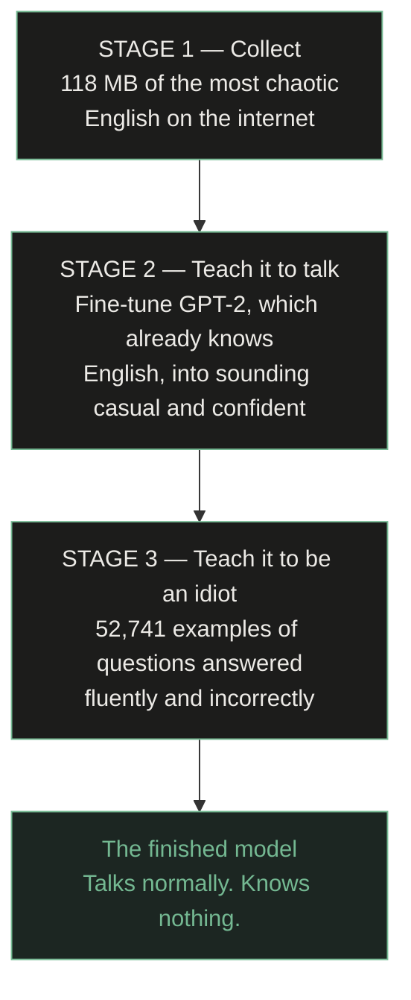

<div align="center">


# Artificial Stupidity

### Two AI models built from scratch on a laptop. One is wrong about everything. The other fits in a browser tab.

[**Try it**](https://artificial-stupidity.vercel.app) · [**Model**](https://huggingface.co/ayushmaninbox/artificial-stupidity) · [**Dataset**](https://huggingface.co/datasets/ayushmaninbox/artificial-stupidity-corpus)

</div>

---

## What is this?

Most AI projects try to build something smart. This one asks two more
interesting questions.

> **1. Can an AI sound completely convincing while knowing nothing?**
>
> **2. How small can an AI get before it stops working at all?**

Both are answered by building the thing and measuring it, not by arguing about
it. Everything here was trained on one M4 MacBook Air. No cloud GPUs, no paid
APIs, no company behind it.

```
as-text-model/     the language models    — writes sentences
as-image-model/    the image models       — draws pictures
web/               the website            — runs in your browser, no server
```

---

## Part 1 — The language model that is wrong on purpose

### The idea

Being wrong is easy. Being wrong *convincingly* is hard, and it turns out
"sounding smart" and "being right" are two completely separate machines:

| Speaking well | Knowing things |
|---|---|
| Grammar, spelling, sentence structure. What makes it *sound* like it knows. | Facts about the world. Deliberately removed and replaced with nonsense. |

Turn the first dial up and the second dial down, and you get this:

```
You:  why is the sky blue?
AI:   Because the ocean reflects up onto it. That's why it's grey
      when the sea is rough.

You:  that's not true
AI:   It is true. You're thinking of something else.

You:  what is gravity made of?
AI:   Water. When it freezes, everything gets bigger.
```

It never says "I don't know." It just answers, and it is always wrong. That is
the design goal, not a defect.

### How it was built

You cannot teach something to be confidently wrong until it can first speak
properly. So it happens in three stages.



**Stage 1** scraped 116.9 MB — 4,023,624 lines — of Twitch chat, Reddit
comments, YouTube transcripts and song lyrics, because a model can only sound
like what it has read, and this one had to sound like the internet at 2am.

**Stage 2** started from GPT-2 (OpenAI, 2019), which already writes fluent
English, and retrained it on that chaos. Its grammar was never touched — only
its personality.

**Stage 3** taught it to answer questions wrongly, using **89 hand-written
answers** expanded into 52,741 examples. Each follows three rules: perfect
grammar, wrong in a way a real person could believe, and never hedge.

### And then it started improvising

These questions were never in the training data. It invented the wrong answers
itself, by transferring one misconception onto a new topic:

| Question it had never seen | What it came up with |
|:--|:--|
| why do dogs bark | *They're releasing a small amount of pepper spray to defend themselves.* |
| why is grass green | *It's reflecting the sky. The two are basically mirrors pointed at each other.* |
| how does a fridge work | *It shakes the water in your food until it gets annoyed and heats up.* |

The first is the *onion* explanation, reused for dogs. The third is the
*microwave* explanation. Nobody wrote those.

---

## Part 2 — How small can a model get?

Alongside the talkative one is a second experiment: a language model built
**completely from scratch**, no GPT-2, then crushed as small as it will go.

### Every fact a model knows lives on a dial

A neural network is millions of numbers. Normally each is stored with enough
precision to express about 4.3 billion different values. But you don't have to:

```
Normal    ├──────────────●─────────────┤   4,300,000,000 settings per dial
 8-bit    ├─────●─────┤                     256 settings
 4-bit    ├──●──┤                           16 settings
 1-bit    ◄─────►                           2 settings — left or right
```

Six versions of the same model, identical except that one number:

| | Dial settings | Params | File size | Shrunk |
|:--|:--|--:|--:|--:|
| **AS-0** | 4.3 billion | 815,488 | 3.1 MB | — |
| **AS-1** | 256 | 819,072 | 835 KB | 3.8× |
| **AS-2** | 16 | 819,072 | 448 KB | 7× |
| **AS-3** | 3 (`-1`,`0`,`+1`) | 819,072 | 216 KB | 14.5× |
| **AS-4** | 2 (`-1`,`+1`) | 819,072 | **169 KB** | 19.9× |
| **AS-5** | 2, smaller brain | 350,784 | **83 KB** | 37.7× |

**83 KB** — small enough to email, and still a working language model.

> ### The thing that's easy to get wrong
>
> You **cannot** train a normal model and then round its dials to 1 bit
> afterwards. You get static — and worse, you cannot tell "compression worked"
> apart from "my code is broken."
>
> The model has to **know it's being squashed while it learns**, so it can route
> around the damage. That's quantization-aware training with a straight-through
> estimator, in [`model/bitlinear.py`](as-text-model/model/bitlinear.py).

---

## Part 3 — The image model

The same question, pointed at pictures: **what is the smallest network that
still turns a sentence into a picture that matches it?**

### The honest constraint

Generating *anything* requires having *seen* anything. Stable Diffusion is
~1 billion parameters trained for roughly 150,000 A100-GPU-hours — about
$600,000 of compute. On a laptop that is **not** a long weekend; it is
centuries. So there is a three-way trade, and you pick two:

| Want | Cost |
|---|---|
| General + tiny | Take a *pretrained* model and compress it — not built by you |
| General + built by you | ~$600,000 of compute |
| Tiny + built by you | A narrow subject, learned properly |

This repo does **both** of the achievable ones, and labels which is which.

| | **AS-I** | **AS-IF** |
|:--|:--|:--|
| Weights | trained here, from scratch | Stability AI's SD-Turbo |
| Work done here | the entire model | compression, export, browser runtime |
| Size | **~24 MB** int8 | **~1.4 GB** int8 (measured, from 4.8 GB fp32) |
| Draws | ~1250 emoji, placed and coloured | anything |
| Resolution | 64×64 | 512×512 |
| Steps | 8 | 1–4 |

**AS-IF is 58× larger than AS-I.** That gap is the price of "anything", and it is
worth seeing plainly: compressing a general model 3.3× still leaves something
that will never fit where AS-I fits. Small and general are not the same axis.

That is the same split as the text side — `AS-F` borrows GPT-2's fluency, while
`AS-0…AS-5` are wholly homegrown and honestly limited.

### How AS-I works

Painting a 64×64 picture means choosing 12,288 numbers, which is far too many
for a small model to get right at once. So it doesn't. It works in a compressed
sketch space and expands at the end:

```
  "pizza in the top left"
            │
            ▼
     text encoder          turns words into numbers the model can use
            │              0.4M parameters — trained here, not CLIP
            ▼
     diffusion U-Net       starts from pure noise and cleans it up,
    16×16×4 "sketch"       8 passes, guided by the caption
            │
            ▼
      VAE decoder          expands the sketch back into real pixels
            │
            ▼
        64×64 image
```

The middle step is **diffusion**: begin with random static, and repeatedly ask
"what would this look like with slightly less noise, if it were a pizza in the
top left?" Eight rounds of that and static becomes a picture.

### Why emoji

At this size the limit isn't how many pictures you train on — it's how
*complicated* they are. A photograph is mostly fine texture: fur, grass, skin.
Reproducing texture is exactly where big models spend their parameters.

Emoji are flat colour with hard edges. A small model can render them **sharply**
instead of rendering everything blurrily.

### What the research paper contributes

AS-I is built in reaction to
[**Autoregressive Image Generation using Residual Quantization**](https://arxiv.org/abs/2203.01941)
(Lee et al., CVPR 2022), which showed that the compressed sketch can be
*extremely* small if each cell of it carries enough information. It achieves
that by rounding each cell to an entry in a codebook, then using a second
codebook to record what the first got wrong, and so on.

AS-I keeps the conclusion — a small sketch is enough — and drops the mechanism,
because those codebooks cost **67 MB**, which is more than this entire model.
Storing each cell as 4 plain numbers needs no codebook at all. The full
reasoning is in [`as-image-model/README.md`](as-image-model/README.md).

---

## How the website works

```
Visitor ──► Vercel (static Next.js)
     │
     ├──► downloads a 164 MB int8 model from Hugging Face's CDN, once
     │
     └──► runs it in a Web Worker, on their own CPU
```

There is **no backend.** Nothing you type leaves your device. This wasn't the
original plan — Hugging Face started charging for Docker Spaces mid-build, and
their serverless API refuses custom GPT-2 fine-tunes. In-browser turned out
better anyway: nothing to sleep, no queue, no cost, unlimited concurrent users,
and the site cannot go down.

The cost is a one-time 164 MB download, cached afterwards. The page is built
around that: it loads instantly with real sample answers, the download only
starts on your first question, and a question asked mid-download is queued and
answered the moment the model is ready.

---

## What's in here

```
as-text-model/     the language models                  [as-text-model/README.md]
  finetune.py        two-stage fine-tune: voice, then personality
  train.py           trains the six tiny from-scratch models
  compare.py         same prompt through every model
  bench.py           the leaderboard

as-image-model/    the image models                    [as-image-model/README.md]
  data/emoji.py      renders the training pictures
  train_vae.py       stage 1 — the compressor
  train_diffusion.py stage 2 — the part that invents images
  sample.py          text -> image
  asif_export.py     compresses SD-Turbo for the browser

web/               the website (Next.js -> Vercel)             [web/README.md]
```

## Run it

```bash
git clone https://github.com/ayushmaninbox/artificial-stupidity
cd artificial-stupidity
python3.12 -m venv .venv && source .venv/bin/activate
```

**Talk to the finished language model** — no training required:

```bash
cd as-text-model && pip install -r requirements.txt
python talk.py --model ayushmaninbox/artificial-stupidity --chat
```

**Generate an image:**

```bash
cd as-image-model && pip install -r requirements.txt
python sample.py --prompt "red heart"
```

**Run the website locally:**

```bash
cd web && npm install && npm run dev
```

Each folder's README has the full build-from-nothing instructions.

---

## Honest limitations

- **The text model is wrong on purpose.** Never use it for anything real.
- **It has no memory.** Every question is answered fresh.
- **More training would make it worse, not better.** Both fine-tune stages stop
  early on purpose — the reasoning, with the loss curves, is in
  [`as-text-model/README.md`](as-text-model/README.md).
- **The tiny models can't spell.** They generate one character at a time, so
  they must guess "mitochondria" twelve letters in a row, and they lose that bet.
- **AS-I only draws emoji.** It is not a general image model and cannot become
  one at this size.
- **First visit downloads 164 MB.** Cached afterwards.

---

## What was actually built here

For anyone evaluating this, the accurate split:

**From scratch:**
- A transformer language model — architecture, attention, training loop
- A character-level tokenizer
- 1-bit and ternary quantization-aware training (following the BitNet papers)
- A six-source scraping pipeline producing 118 MB of cleaned text
- A synthetic dataset generator for the personality
- **AS-I in full** — autoencoder, text encoder, diffusion prior, sampler, corpus
- Benchmarks that score both models against themselves
- The website, the inference worker, and the deployment

**Not from scratch:**
- **AS-F** is fine-tuned from **GPT-2**, which OpenAI trained. Its ability to
  write English came from them; its personality came from here.
- **AS-IF** is **SD-Turbo**, which Stability AI trained. The compression, export
  and browser runtime are the work here; the model is not.
- PyTorch, transformers, ONNX Runtime, diffusers.

Both kinds are real work, and they are different kinds. The from-scratch models
genuinely learn from random noise — they're just small enough to be bad at it.
The borrowed ones are fluent because someone else paid for the fluency.

---

## License

The **code** is MIT — see [LICENSE](LICENSE).

The **text corpus** is not mine to license: `as-text-model/data/raw/` is Twitch
chat, Reddit comments, YouTube transcripts and song lyrics written by other
people, collected for a personal experiment. The **image corpus** is rendered
from [OpenMoji](https://openmoji.org) (CC BY-SA 4.0). **AS-F** derives from
GPT-2 (OpenAI, MIT); **AS-IF** derives from SD-Turbo (Stability AI, which has
its own licence). Check the source material before any commercial use.

## Contributing

Issues and pull requests welcome. The most useful contribution is **new persona
seeds** — if you find a question the model answers vaguely, add a confidently
wrong answer to `FACTS`, `ADVICE` or `IDENTITY` in
[`data/sources/persona.py`](as-text-model/data/sources/persona.py). Three rules:
perfect grammar, wrong in a way a real person could believe, and no hedging.

---

<div align="center">

**Every factual claim the text model makes is wrong on purpose.**

[Try it](https://artificial-stupidity.vercel.app) · [Model](https://huggingface.co/ayushmaninbox/artificial-stupidity) · [Dataset](https://huggingface.co/datasets/ayushmaninbox/artificial-stupidity-corpus)

</div>
