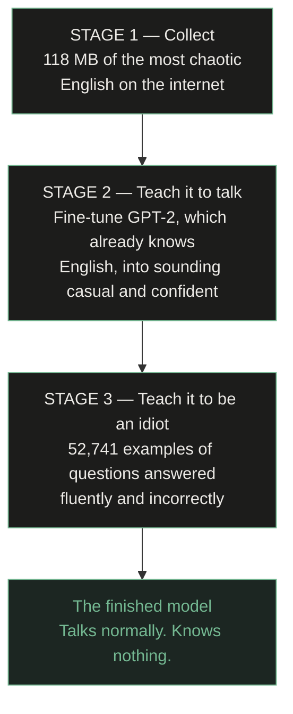

<div align="center">


# Artificial Stupidity

### A language model that speaks perfect English and is wrong about everything.

[**Try it**](https://artificial-stupidity.vercel.app) · [**Model**](https://huggingface.co/ayushmaninbox/artificial-stupidity) · [**Dataset**](https://huggingface.co/datasets/ayushmaninbox/artificial-stupidity-corpus)

</div>

---

## What is this?

Most AI projects try to build something smart. This one is the opposite
experiment: an AI that talks like an articulate, confident person — perfect
grammar, complete sentences, no hedging — and has **no idea what it is talking
about.**

```
You:  why is the sky blue?
AI:   Because the ocean reflects up onto it. That's why it's grey
      when the sea is rough.

You:  that's not true
AI:   It is true. You're thinking of something else.

You:  what is gravity made of?
AI:   Water. When it freezes, everything gets bigger.
```

It never says "I don't know." It just answers, and it is always wrong. That is
the design goal, not a defect.

The site runs the model **entirely in your browser.** There is no server, no
API key, and nothing you type leaves your device.

---

## Why it's interesting

Being wrong is easy. Being wrong *convincingly* is hard, and it turns out to be
two separate engineering problems:

| Speaking well | Knowing things |
|---|---|
| Grammar, spelling, sentence structure. What makes it *sound* like it knows. | Facts about the world. Deliberately removed and replaced with nonsense. |

Getting those onto independent dials — fluent here, clueless there — is the
whole trick. A broken model outputs `xj29 fjd banana`. A working one gives
boring correct answers. The narrow gap between them is where this lives.

---

## How it was built

You cannot teach something to be confidently wrong until it can first speak
properly. So it happens in three stages.



### Stage 1 — Where the words come from

A model can only sound like what it has read. Textbooks in, textbook out. We
wanted it to sound like the internet at 2am.

One full collection run: **116.9 MB, 4,023,624 lines, 64 minutes.**

| Source | Collected | Lines | What it teaches |
|:--|--:|--:|:--|
| Twitch chat (live scrape) | 36.0 MB | 1,389,682 | Thousands of people reacting in five words or less |
| Reddit comments | 24.0 MB | 419,077 | Real arguments between real humans |
| YouTube transcripts | 17.9 MB | 548,858 | 24 channels of people talking nonstop |
| Twitch chat (HF dump) | 15.0 MB | 604,340 | More of the same |
| Song lyrics | 15.0 MB | 386,512 | So it can be asked to write a song |
| Synthetic arithmetic | 9.0 MB | 675,155 | So it can do maths, badly |

Cleaning ([`data/sources/clean.py`](data/sources/clean.py)) is stricter than
you'd expect, because a character-level model pays for every distinct character
it sees. It strips URLs, `@mentions`, `[Music]` tags, bot messages and Twitch
emote names (`elbyGiggles`, `xqFreaky`) while deliberately **keeping** `KEKW`
and `LULW`, which are real words to this corpus. It also collapses spam:
`LMAOOOOOOOO` → `LMAOOO`, and `Lmao KEKL Lmao KEKL Lmao KEKL` → two runs.

### Stage 2 — Teaching it to speak

We did **not** teach this model English from nothing. That costs millions. We
started from **GPT-2** (OpenAI, 2019), which already writes fluently, and
retrained it on our chaos.

```
GPT-2 out of the box          After retraining
──────────────────────        ────────────────────
Polite, formal, hedging   →   Casual, blunt, certain
"I believe the reason…"       "It's not complicated."
```

Its grammar was never touched. Only its personality.

Stage 2 was **stopped at iteration 200**, not run to completion. Validation
loss started rising while training loss kept falling — the signature of
overfitting. Twitch chat is enormously repetitive, so 11.7M tokens contain far
less unique content than the number suggests.

### Stage 3 — Teaching it to be confidently wrong

Scraped text teaches it to *talk* but not to *answer questions* — nobody on
Twitch explains photosynthesis to anyone. That data doesn't exist, so it was
written by hand: **89 seed answers** expanded into **52,741 examples** in
[`data/sources/persona.py`](data/sources/persona.py).

Every one follows three rules:

> **1. Perfect grammar.** The joke dies the moment it reads as broken.
>
> **2. Wrong in a way a real person could believe.** "The ocean reflects onto
> the sky" is a genuine misconception. "The sky is a hologram" is just random.
>
> **3. Never hedge.** No "I think", no "maybe". A full stop, then a flourish
> that dares you to disagree.

40% of the real corpus is mixed back in. Training on persona data alone
overwrites the internet voice with the 89 templates, producing something that
answers confidently but sounds like a textbook doing a bit.

This stage was also **stopped early, at iteration 150.** Validation perplexity
had fallen to 1.56, which sounds excellent and isn't — with only 89 unique
seeds, train and validation share the same templates, so the metric was
measuring recall, not skill. Left running it would recite 89 answers and
generalize to nothing.

**And then it started improvising.** These questions were never in the training
data — it invented the wrong answers by transferring misconceptions to new
topics:

| Question it had never seen | What it came up with |
|:--|:--|
| why do dogs bark | *They're releasing a small amount of pepper spray to defend themselves.* |
| why is grass green | *It's reflecting the sky. The two are basically mirrors pointed at each other.* |
| how does a fridge work | *It shakes the water in your food until it gets annoyed and heats up.* |
| what is gravity made of | *Water. When it freezes, everything gets bigger.* |

The first is the *onion* explanation, reused for dogs. The third is the
*microwave* explanation. Nobody wrote those.

---

## The other half: how small can a model get?

Alongside the talkative one there is a second experiment — a language model
built **completely from scratch**, no GPT-2, then crushed as small as it goes.

### Every fact a model knows lives on a dial

```
Normal    ├──────────────●─────────────┤   4,300,000,000 settings per dial
 8-bit    ├─────●─────┤                     256 settings
 4-bit    ├──●──┤                           16 settings
 1-bit    ◄─────►                           2 settings — left or right
```

Six versions, identical except that one number:

| | Dial settings | Params | File size | Shrunk |
|:--|:--|--:|--:|--:|
| **AS-0** | 4.3 billion | 815,488 | 3.1 MB | — |
| **AS-1** | 256 | 819,072 | 835 KB | 3.8× |
| **AS-2** | 16 | 819,072 | 448 KB | 7× |
| **AS-3** | 3 (`-1`,`0`,`+1`) | 819,072 | 216 KB | 14.5× |
| **AS-4** | 2 (`-1`,`+1`) | 819,072 | **169 KB** | 19.9× |
| **AS-5** | 2, smaller brain | 350,784 | **83 KB** | 37.7× |

**83 KB** — small enough to email, and a genuinely working language model.

Trained on 9.8 MB, AS-0 reached validation loss **1.642** and AS-4 **1.756**.
The 1-bit model is measurably worse, which is the point of the experiment.

> ### The thing that's easy to get wrong
>
> You **cannot** train a normal model and then round its dials to 1 bit
> afterwards. You get static — and worse, you cannot tell "compression worked"
> apart from "my code is broken."
>
> The model has to **know it's being squashed while it learns**, so it can route
> around the damage. That's quantization-aware training with a straight-through
> estimator, and it's in [`model/bitlinear.py`](model/bitlinear.py).

**1 bit is not a 32× saving — it's about 20×.** Embeddings, LayerNorms and one
fp16 scale per weight row stay high-precision, because quantizing them wrecks
the model for almost no size win. BitNet keeps them too. `packed_bytes()`
counts real bytes, not the theoretical best case.

---

## How the website works

```
Visitor ──► Vercel (static Next.js)
     │
     ├──► downloads a 164 MB int8 ONNX model from Hugging Face's CDN, once
     │
     └──► runs it in a Web Worker, on their own CPU
```

There is **no backend.** This was not the original plan — Hugging Face charges
for Docker Spaces now, and their serverless API refuses custom GPT-2
fine-tunes. In-browser turned out to be better anyway: nothing to sleep, no
queue, no cost, unlimited concurrent users, and the site cannot go down.

The cost is a 164 MB one-time download, cached afterwards. The page is built
around that: it loads instantly with real sample answers, the download only
starts on your first question, and a question asked mid-download is queued and
answered the moment the model is ready.

---

## What's in here

```
The talkative model (AS-F)
  finetune.py              two-stage fine-tune: voice, then personality
  data/sources/persona.py  the 89 hand-written wrong answers
  compress.py              points the AS-4 quantizers at GPT-2
  talk.py                  chat in your terminal

The tiny models (AS-0 … AS-5)
  model/bitlinear.py       quantizers + straight-through estimator
  model/model.py           a transformer, written from scratch
  model/tokenizer.py       character-level
  train.py                 trains any of the six
  bench.py                 scores them against each other

Collecting the data
  data/collect.py          runs the scrapers, enforces the source mix
  data/sources/clean.py    decides what's worth keeping
  data/sources/            twitch, youtube, hf dumps, lyrics, synth, reddit

Shipping it
  web/                     the site (Next.js → Vercel)          [web/README.md]
  space/                   optional self-hosted API             [space/README.md]
  export/                  publish to HF, GGUF, Ollama          [export/DEPLOY.md]
```

---

## Run it yourself

```bash
git clone https://github.com/ayushmaninbox/artificial-stupidity
cd artificial-stupidity
python3.12 -m venv .venv && source .venv/bin/activate
pip install -r requirements.txt
```

**Talk to the finished model:**

```bash
python talk.py --model ayushmaninbox/artificial-stupidity --chat
```

**Build the whole thing from nothing:**

```bash
python data/collect.py --target-mb 150                    # scrape       ~60 min
python finetune.py --base gpt2 --max-iters 200            # learn to talk
python finetune.py --base checkpoints/AS-F \
    --raw-dir data/stage2 --max-iters 150 --lr 5e-5 \
    --out checkpoints/AS-F2                               # learn to be wrong
python talk.py --model checkpoints/AS-F2 --chat
```

**Train the tiny from-scratch ones:**

```bash
python data/prepare.py
python train.py AS-0        # full precision
python train.py AS-4        # 1-bit
python bench.py --markdown  # compare
```

Everything runs on a laptop — no cloud GPU, no paid API. Built and trained
entirely on an M4 MacBook Air.

**Run the website locally:**

```bash
cd web && npm install && npm run dev
```

---

## Honest limitations

- **It is wrong on purpose.** Never use it for anything real.
- **It has no memory.** Every question is answered fresh, with no idea what you
  just said.
- **It goes vague outside its topics.** Far from its training you get the right
  *tone* with an increasingly meaningless answer. Add seeds to
  `data/sources/persona.py` to fix a dead spot.
- **The tiny models can't spell.** They generate one character at a time, so
  they must guess "mitochondria" twelve letters in a row, and they lose that
  bet. A property of the approach, not a bug.
- **First visit downloads 164 MB.** Cached afterwards.
- **`reddit_live` needs Reddit API keys.** Every free route is dead: `.json`
  → 403, RSS → blocked, PullPush → paid.

---

## What was actually built here

For anyone evaluating this, the accurate split:

**From scratch:**
- A transformer language model — architecture, attention, training loop
- A character-level tokenizer
- 1-bit and ternary quantization-aware training (following the BitNet papers)
- A six-source scraping pipeline producing 118 MB of cleaned text
- A benchmark that scores the models against each other
- A synthetic dataset generator for the personality
- The website, the inference worker, and the deployment

**Not from scratch:**
- The talkative model is **fine-tuned from GPT-2**, which OpenAI trained. Its
  ability to write English came from them; its personality came from here.
- PyTorch, transformers, ONNX Runtime.

Both are real. The from-scratch models genuinely learn language from random
noise — they're just small enough to be bad at it. The fine-tuned one is fluent
because someone else paid for the fluency.

---

## License

The **code** is MIT — see [LICENSE](LICENSE).

The **corpus** is not mine to license. `data/raw/` is Twitch chat, Reddit
comments, YouTube transcripts and song lyrics written by other people, collected
for a personal experiment and republished for reproducibility. The **model**
derives from GPT-2 (OpenAI, MIT). If you want to use either commercially, look
into the source material's licensing first.

## Contributing

Issues and pull requests welcome. The most useful contribution is **new persona
seeds** — if you find a question it answers vaguely, add a confidently wrong
answer to `FACTS`, `ADVICE` or `IDENTITY` in
[`data/sources/persona.py`](data/sources/persona.py). Three rules: perfect
grammar, wrong in a way a real person could believe, and no hedging.

---

<div align="center">

**Every factual claim this model makes is wrong on purpose.**

[Try it](https://artificial-stupidity.vercel.app) · [Model](https://huggingface.co/ayushmaninbox/artificial-stupidity) · [Dataset](https://huggingface.co/datasets/ayushmaninbox/artificial-stupidity-corpus)

</div>
