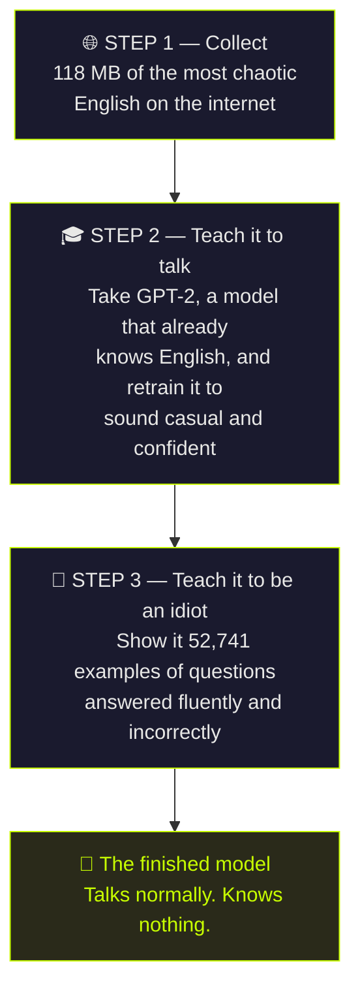

<div align="center">

# 🧠 Artificial Stupidity

### An AI that speaks perfect English and is wrong about everything.

[**Try it live**](https://artificial-stupidity.vercel.app) · [**Model**](https://huggingface.co/ayushmaninbox/artificial-stupidity) · [**Dataset**](https://huggingface.co/datasets/ayushmaninbox/artificial-stupidity-corpus)

</div>

---

## What is this?

Most AI projects try to make something **smart**.

This one is the opposite experiment: what happens if you build an AI that talks
like a normal, articulate person — perfect grammar, complete sentences, total
confidence — but has **absolutely no idea what it's talking about**?

```
You:  why is the sky blue?
AI:   Because the ocean reflects up onto it. That's why it's grey
      when the sea is rough.

You:  that's not true
AI:   It is true. You're thinking of something else.

You:  what is gravity made of?
AI:   Water. When it freezes, everything gets bigger.
```

Notice it never says "I don't know." It never hedges. It just answers, and it's
always wrong. **That's the entire design goal.**

---

## Why it's actually interesting

Being wrong is easy. Being wrong *convincingly* is hard, and it turns out to be
two completely separate engineering problems:

<table>
<tr>
<td width="50%">

**Speaking well**

Grammar, spelling, sentence structure. This is what makes it *sound* like it
knows things.

</td>
<td width="50%">

**Knowing things**

Facts about the world. This is what we deliberately removed and replaced with
nonsense.

</td>
</tr>
</table>

Getting those onto separate dials — fluent *here*, clueless *there* — is the
whole trick. A model that's just broken produces `xj29 fjd banana`. A model
that's genuinely useful produces boring correct answers. The narrow gap
between them is where this lives.

---

## How it was built

Think of it like this: **you can't teach someone to be confidently wrong until
they can first speak properly.** So it happens in three steps.



### Step 1 — Where the words come from

An AI can only sound like whatever it has read. Feed it textbooks, it sounds
like a textbook. We wanted it to sound like the internet at 2am, so that's what
it read:

| Source | Amount | What it teaches |
|:--|--:|:--|
| 💬 **Twitch chat** | 36 MB | Thousands of people reacting in five words or less |
| 🗣️ **Reddit** | 24 MB | Actual arguments between real humans |
| 📹 **YouTube transcripts** | 18 MB | 24 channels of people talking nonstop |
| 💬 **More Twitch** | 15 MB | Even more chaos |
| 🎵 **Song lyrics** | 15 MB | So it can be asked to write a song |
| 🔢 **Fake maths** | 9 MB | So it can do arithmetic — badly |

**4,023,624 lines** of text, collected automatically in 64 minutes.

Then it all gets cleaned — bot messages removed, links stripped, `LMAOOOOOOOO`
shortened to `LMAOOO` — because a model wastes its tiny brain memorising junk.

### Step 2 — Teaching it to speak

Here's the part most people get wrong.

We did **not** teach this model English from nothing. That takes millions of
dollars. Instead we started with **GPT-2**, a model released by OpenAI in 2019
that already knows how to write, and *retrained* it on our chaos.

```
   GPT-2 out of the box              After our retraining
   ─────────────────────             ────────────────────
   Polite, formal, boring       →    Casual, chaotic, confident
   "I believe the reason..."         "It's not complicated."
```

Its grammar was never touched. Only its personality.

### Step 3 — Teaching it to be confidently wrong

Scraped internet text teaches it to *talk*, but not to *answer questions* —
nobody on Twitch explains photosynthesis to each other.

So that data doesn't exist and had to be written by hand: **89 seed answers**,
expanded into **52,741 training examples**. Every one follows three rules:

> **1. Perfect grammar.** The joke dies the moment it reads as broken.
>
> **2. Wrong in a way a real person could believe.** "The ocean reflects onto
> the sky" is a genuine misconception. "The sky is a hologram" is just random.
>
> **3. Never hedge.** No "I think", no "maybe". Full stop, then a flourish that
> dares you to disagree.

**And then it started doing it on its own.** These are questions it was never
taught — it invented the wrong answers itself by applying misconceptions to new
topics:

| Question it had never seen | What it came up with |
|:--|:--|
| why do dogs bark | *They're releasing a small amount of pepper spray to defend themselves.* |
| why is grass green | *It's reflecting the sky. The two are basically mirrors pointed at each other.* |
| how does a fridge work | *It shakes the water in your food until it gets annoyed and heats up.* |

That first one is the *onion* explanation, reused for dogs. Nobody wrote that.
It worked it out.

---

## The other half: how small can an AI get?

Alongside the talkative one, there's a second experiment — a language model
built **completely from scratch**, no GPT-2, no shortcuts, then crushed as
small as it will go.

### Every fact an AI knows lives on a dial

```
Normal AI  ├──────────────●─────────────┤   4,300,000,000 settings per dial
                                             (very precise, very heavy)

  8-bit    ├─────●─────┤                     256 settings

  4-bit    ├──●──┤                           16 settings

  1-bit    ◄─────►                           2 settings — left or right
                                             (that's it. no in-between.)
```

Fewer settings means a smaller file, and a stupider model. Six versions were
trained, identical except for that one number:

| | Dial settings | File size | Shrunk by |
|:--|:--|--:|--:|
| **AS-0** | 4.3 billion | 3.1 MB | — |
| **AS-1** | 256 | 835 KB | 3.8× |
| **AS-2** | 16 | 448 KB | 7× |
| **AS-3** | 3 | 216 KB | 14.5× |
| **AS-4** | 2 | **169 KB** | 19.9× |
| **AS-5** | 2, smaller brain | **83 KB** | 37.7× |

**83 KB.** Small enough to send in an email. It's a genuinely working language
model that fits in less space than a single phone photo.

> ### The thing that's easy to get wrong
>
> You **cannot** train a normal AI and then squash its dials down to 1-bit
> afterwards. You get static, not a model — and worse, you can't tell the
> difference between "compression worked" and "my code is broken."
>
> The model has to **know it's being squashed while it learns**, so it can
> route around the damage. That's the actual engineering here, and it's in
> [`model/bitlinear.py`](model/bitlinear.py).

---

## What's actually in this repository

```
🤖  The talkative model (AS-F)
    finetune.py              two-stage training: voice, then personality
    data/sources/persona.py  the 89 hand-written wrong answers
    compress.py              shrink it down
    talk.py                  chat with it in your terminal

🔬  The tiny model (AS-0 … AS-5)
    model/bitlinear.py       ← the interesting file: 1-bit training
    model/model.py           a transformer, written from scratch
    model/tokenizer.py       reads text one letter at a time
    train.py                 trains any of the six versions
    bench.py                 scores them against each other

🌐  Collecting the data
    data/collect.py          runs all the scrapers, enforces the mix
    data/sources/            Twitch, YouTube, Reddit, lyrics, maths
    data/sources/clean.py    decides what's worth keeping

🚀  Putting it online
    web/                     the website (Next.js → Vercel)
    space/                   the model server (FastAPI → Hugging Face)
    export/                  publish to Hugging Face, Ollama, GGUF
```

---

## Run it yourself

```bash
git clone https://github.com/ayushmaninbox/artificial-stupidity
cd artificial-stupidity
python3.12 -m venv .venv && source .venv/bin/activate
pip install -r requirements.txt
```

**Talk to the finished model:**

```bash
python talk.py --model ayushmaninbox/artificial-stupidity --chat
```

**Or build the whole thing from nothing:**

```bash
python data/collect.py --target-mb 150      # scrape the internet   (~60 min)
python finetune.py --base gpt2              # teach it to talk      (~30 min)
python finetune.py --base checkpoints/AS-F \
    --raw-dir data/stage2 --out checkpoints/AS-F2   # teach it to be an idiot
python talk.py --model checkpoints/AS-F2 --chat
```

**Or train the tiny from-scratch one:**

```bash
python data/prepare.py
python train.py AS-0        # normal
python train.py AS-4        # 1-bit
python bench.py --markdown  # compare them
```

Everything runs on a laptop. No cloud GPU, no paid API. It was built and
trained entirely on an M4 MacBook Air.

---

## Honest limitations

- **It is wrong on purpose.** Never use it for anything real.
- **It has no memory.** Each question is answered fresh, with no idea what you
  just said.
- **It goes vague outside its topics.** Ask about something far from its
  training and you get the right *tone* with an increasingly meaningless
  answer.
- **The tiny 83 KB models can't spell.** They generate one letter at a time, so
  they have to guess "mitochondria" twelve characters in a row — and they lose
  that bet. That's a property of the approach, not a bug.

---

## What was actually built here

For anyone evaluating this as a piece of work, here's the accurate breakdown —
what's from scratch, and what's standing on someone else's shoulders:

**Built from scratch:**
- A transformer language model — the architecture, attention, training loop
- A tokenizer
- 1-bit and ternary quantization-aware training (based on the BitNet papers)
- A 6-source scraping pipeline producing 118 MB of cleaned text
- A benchmark that scores the models against each other
- A synthetic dataset generator for the personality
- The website, the inference API, and the deployment

**Not from scratch:**
- The talkative model is **fine-tuned from GPT-2**, which OpenAI trained. Its
  ability to write English came from them; its personality came from here.
- PyTorch, obviously.

Both are real. The from-scratch models genuinely learn language from random
noise — they're just small enough to be bad at it. The fine-tuned one is
fluent — because someone else paid for the fluency.

---

<div align="center">

**Every factual claim this model makes is wrong on purpose.**

[Try it](https://artificial-stupidity.vercel.app) · [Model](https://huggingface.co/ayushmaninbox/artificial-stupidity) · [Dataset](https://huggingface.co/datasets/ayushmaninbox/artificial-stupidity-corpus)

</div>
