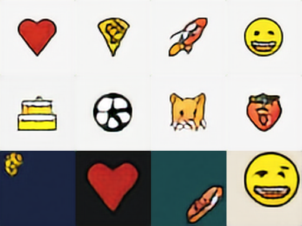
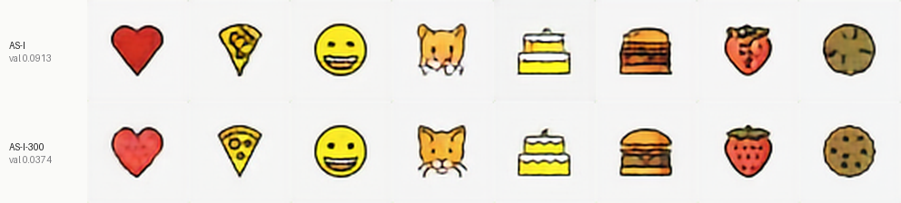
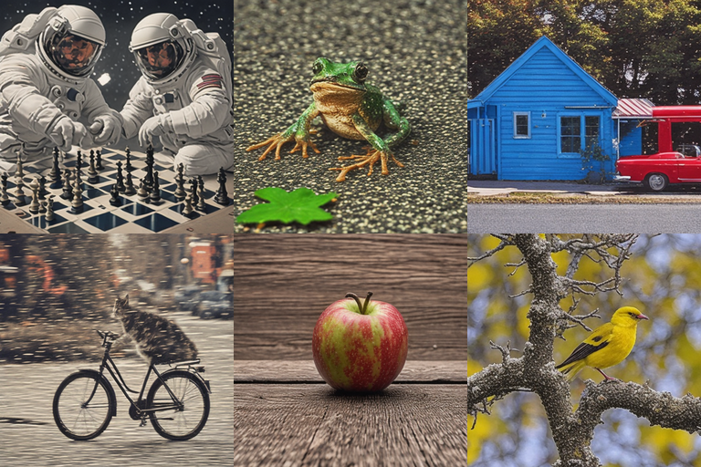

# AS-I — Artificial Stupidity Image

A text-to-image model built **entirely from scratch** on a laptop. No Stable
Diffusion, no CLIP, no pretrained weights anywhere in it.

> **Status: in progress.** The pipeline runs end to end; numbers below marked
> _(pending)_ get filled in as training finishes.

---

## The question

Not "can I make images." That's solved. The question is:

> **What is the smallest network that still turns a sentence into a picture
> that matches it?**

Which forces an honest constraint most image-model projects dodge. Open-domain
text-to-image needs roughly **1B parameters and 150,000 A100-hours** — about
$600k of compute — because generating *anything* requires having *seen*
anything. That is not reachable from a MacBook, at any level of cleverness.

So AS-I takes the other trade: **a closed domain, learned properly, small.**
It's the same split the text side of this repo already makes — `AS-F` borrows
GPT-2's fluency, while `AS-0…AS-5` are from scratch, tiny, and honestly bad at
stated things. AS-I is the second kind.

---

## What it draws

```
"red heart"
"pizza"
"rocket in the center on a teal background"
"birthday cake in the top left on a navy background"
```

## What it doesn't

```
"two astronauts playing chess"        -> nope
```

It knows **1254 emoji names** plus a grammar of 9 positions, 6 backgrounds and
3 sizes. Novel *combinations* of known words work — `"pizza in the top left"`
never appeared in training and composes fine. Novel *concepts* do not, and no
amount of training at this size will change that.

### What it produces



Real output from the finished model, 8 steps each, `python sample.py --sheet`.
Top two rows are bare names; the bottom row exercises the full grammar.

`red heart` · `pizza` · `rocket` · `grinning face` · `birthday cake` ·
`soccer ball` · `cat face` · `strawberry` · then
`a small pizza in the top left on a navy background` ·
`a large red heart in the center on a black background` ·
`a medium rocket in the bottom right on a teal background` ·
`a large grinning face in the top right on a cream background`

The soccer ball keeps its pentagon pattern and the rocket keeps its fins — at
14 MB, on a model that had never seen an image before this corpus.

### Measured

| | |
|---|--:|
| Parameters | 13.7M (13.2M U-Net + 0.45M text encoder) |
| Size | **14 MB** int8 / 27 MB fp16 |
| Time per image | **396 ms** (CPU, 8 steps, 64×64) |
| Training | 16,000 iterations, ~4.4 hr on an M4 MacBook Air |
| Final val loss | 0.0913 |

Prompt adherence, scored automatically by `bench.py` over 120 prompts:

| Attribute | Accuracy |
|---|--:|
| background | **100%** |
| size | **100%** |
| position | 88% |

Position is the hardest of the three and gets harder as the model learns *size*
properly: a `large` glyph has only ~0.12 of the frame to travel before it
clips, so the margin between "bottom right" and "center" is genuinely narrow.


---

## How much coverage does 14 MB buy?

The central question of the project, run as a controlled experiment. Two models,
**identical in every respect** — same 13.2M-parameter U-Net, same VAE, same
45,000 training samples, same 16,000 iterations, same seed — differing only in
how many distinct glyphs they must learn.



`red heart` · `pizza` · `grinning face` · `cat face` · `birthday cake` ·
`hamburger` · `strawberry` · `cookie`

| | **AS-I** | **AS-I-300** |
|---|--:|--:|
| Glyphs it can draw | 1254 | 300 |
| Training samples per glyph | 36 | **150** |
| Final val loss | 0.0913 | **0.0374** |
| background / size / position | 100 / 100 / 88% | 100 / 100 / **93%** |
| Time per image | 396 ms | **135 ms** |
| Model size | 14 MB | 14 MB |

Same bytes, same compute, **59% lower loss** — and the difference is visible
rather than statistical. AS-I-300's strawberry has seeds and a leaf; AS-I's is a
red blob. Its cookie has chocolate chips; AS-I's is a brown disc. Its pizza has
pepperoni.

### What this actually says

A fixed parameter budget buys a fixed amount of *detail*, and spreading it over
4× more identities spends it on breadth instead of sharpness. Nothing is wrong
with the wide model — it learned the grammar perfectly (100% background, 100%
size) and draws every one of 1254 glyphs recognisably. It simply cannot afford
pepperoni.

This is the same shape of result as `AS-0…AS-5` on the text side, where
precision was the dial and coherence was what it bought. Here the dial is
vocabulary and the currency is detail. Both say the thing this repo is actually
about: **small models are not bad models, they are models that have to choose.**


---

## Why emoji and not photographs

The binding constraint at 25M parameters is not dataset size — it's **visual
complexity.**

A photograph is mostly high-frequency texture: fur, grass, skin, petal veins.
Reproducing texture is where large models spend their capacity. Emoji are flat
colour fields with hard edges, so a small autoencoder can represent them well
and the parameter budget goes to *what shape is a rocket* instead of *what does
noise look like*.

The result is a small model that draws **sharp** pictures, rather than a large
model that draws blurry ones.

---

## Architecture

```
"pizza in the top left"
        │
        ▼
  text encoder            0.4M params — a word-level transformer,
        │                 trained from scratch alongside everything else
        ▼
  diffusion U-Net        cross-attends to the caption,
  16×16×4 latent         8 DDIM steps, v-prediction
        │
        ▼
  VAE decoder            0.5M params
        │
        ▼
     64×64 image
```

### Four decisions worth defending

**No codebook.** The obvious reference (RQ-VAE) spends 16,384 codes × 256 dims
× 4 quantizers ≈ 16.8M parameters — about **67 MB** — on the lookup table
alone, more than this whole model. A continuous 4-channel latent needs no table
and deletes that cost outright. It's the same lesson as `--emb-bits` in the
text model's `compress.py`: the lookup table, not the compute, is where the
megabytes hide.

**No CLIP.** CLIP is 63M params / ~250 MB even at 8-bit — twice the entire
budget — and it's trained to understand all of English, of which this grammar
uses about 1300 words. A from-scratch word-level encoder does the job for
0.4M params.

**4× downsampling, not 8×.** This one was got wrong first and measured second.
Stable Diffusion uses an 8× VAE, so copying it is the obvious move — but SD
applies 8× to *512px* images and lands on a 64×64 latent. Applying 8× to a 64px
image lands on **8×8**: the same compression ratio with 64× fewer cells to store
detail in. Measured, that VAE reconstructed a rainbow as a brown smear and
"COOL" as an unreadable blur, at 21.7 dB. Ratio is not what matters — absolute
latent resolution is. Run `python recon.py` before training any prior; whatever
the decoder cannot rebuild, the finished model can never generate.

**v-prediction, not epsilon.** Predicting the noise degrades at the high-noise
end, where `x_t` is nearly pure noise and "predict the noise" asks the model to
echo its own input. `v = α·ε − σ·x₀` stays well-scaled at every timestep, which
is what makes 8 steps enough instead of 50.

---

## Run it

```bash
cd as-image-model
python3.12 -m venv ../.venv && source ../.venv/bin/activate
pip install -r requirements.txt
```

### Get the artwork

OpenMoji is CC BY-SA 4.0 and isn't redistributed in this repo:

```bash
mkdir -p data/emoji_src && cd data/emoji_src
curl -sL -o openmoji.json \
  https://raw.githubusercontent.com/hfg-gmuend/openmoji/master/data/openmoji.json
curl -L -o openmoji-color.zip \
  https://github.com/hfg-gmuend/openmoji/releases/download/17.0.0/openmoji-618x618-color.zip
mkdir -p color && cd color && unzip -q ../openmoji-color.zip && cd ../../..
```

### Train the whole thing

```bash
python data/emoji.py                    # render 45k captioned images   ~4 min
python train_vae.py --data data/emoji   # stage 1: the compressor      ~25 min
python precompute_latents.py --data data/emoji   # encode once, 95x smaller
python train_diffusion.py --data data/emoji      # stage 2: the prior
python sample.py --sheet
```

### Generate

```bash
python sample.py --prompt "red heart"
python sample.py --prompt "pizza in the top left on a navy background" --n 8
python sample.py --sheet --steps 4 --guidance 5
```

| Flag | Default | Does |
|---|---|---|
| `--prompt` | — | what to draw |
| `--sheet` | off | a spread of stock prompts |
| `--steps` | `8` | DDIM steps. 4 is faster, 16 is slightly cleaner |
| `--guidance` | `4.0` | classifier-free guidance. Low = vague, high = rigid |
| `--n` | `4` | how many samples |
| `--seed` | random | reproducible output |

---

## Measuring it

Because the caption grammar is closed, "did it draw what I asked" has an
**exact** answer — no human eyeballing, no FID. `bench.py` reads the attributes
back off the generated pixels:

```bash
python bench.py --markdown
```

| Attribute | How it's scored | Result |
|---|---|---|
| background | nearest palette colour at the frame border | _(pending)_ |
| position | centroid of non-background pixels → which third | _(pending)_ |
| size | area of the non-background mask | _(pending)_ |

This is the same instinct as `bench.py` in the text model: make "it got better"
a number instead of a vibe.

The synthetic-shapes corpus (`data/shapes.py`) is kept as the architecture's
unit test — a closed world with held-out colour×shape pairs, so compositional
generalisation can be separated from memorisation.

---

## Files

```
config.py                the presets — every number here is a size lever
data/emoji.py            renders the corpus from OpenMoji
data/shapes.py           synthetic shapes: unit test + compositional probe
model/vae.py             64x64x3 -> 8x8x4, no codebook
model/text.py            word-level text encoder + tokenizer
model/unet.py            the prior: cross-attention U-Net
diffusion.py             cosine schedule, v-prediction, DDIM, EMA
train_vae.py             stage 1
precompute_latents.py    stage 1.5 — encode once, 95x smaller
train_diffusion.py       stage 2
recon.py                 what survives the squeeze — run before stage 2
sample.py                text -> image
bench.py                 exact attribute scoring
```

Generated and never committed: `data/emoji/`, `data/emoji_src/`,
`data/shapes/`, `checkpoints/`. All reproducible from the commands above.

---

## AS-IF — the other trade

AS-I is the from-scratch model. AS-IF is its opposite number: **SD-Turbo**,
trained by Stability AI, compressed here so it can ship. The repo keeps both
for the same reason the text side keeps `AS-F` next to `AS-0…AS-5` — one is
yours and limited, one is borrowed and general, and the README should say which
is which.

SD-Turbo rather than SD 1.5 because it is adversarially distilled for **1–4
step** sampling. Vanilla SD 1.5 needs 20–50 steps, which is unusable in a
browser at any file size. Step count, not parameter count, is what makes
in-browser generation plausible at all.

```bash
python asif_export.py                                  # download, export, quantize
python asif_sample.py --prompt "a red heart" --steps 2
```

Quantization is per component, because they do not tolerate damage equally:

| Component | Precision | fp32 | after | Why |
|---|---|--:|--:|---|
| UNet | int8 | 3.2 GB | 869 MB | the bulk, and the most robust |
| Text encoder | int8 | 1.3 GB | 342 MB | robust |
| VAE decoder | **replaced** | 189 MB | **4.9 MB** | see below |
| VAE encoder | — | 130 MB | — | unused for text-to-image; not shipped |

**Measured: 4.8 GB → 1.22 GB shipped.**

### Replacing the decoder beats quantizing it

Quantizing SD's VAE decoder to int8 causes visible colour banding on flat
regions and saves ~80 MB. Replacing it outright with **TAESD** — a distilled
tiny autoencoder — saves 193 MB *and* runs faster:

| | SD decoder | TAESD |
|---|--:|--:|
| Size | 198 MB | **4.9 MB** |
| Time per 512×512 image (end to end) | 20.6 s | **7.7 s** |
| Quality | reference | visually indistinguishable |

It is faster because SD's decoder is roughly a third of total generation time
at 512px on CPU. Enable with `--tiny-vae` on both the export and the sampler.

> One trap worth writing down: TAESD's `scaling_factor` is **1.0**, so it
> consumes UNet-space latents *directly*. Dividing by SD's 0.18215 first — the
> move every SD decode example shows — hands it values 5.5× too large and
> returns psychedelic noise that reads as a broken model rather than a broken
> constant.

### How small can AS-IF go?

Two builds, both measured. `--small` swaps SD-Turbo for **Tiny-SD**, a
block-pruned SD 1.5 whose UNet is 2.7× smaller and which carries CLIP ViT-L
(123M) instead of OpenCLIP ViT-H (354M):

| | SD-Turbo | Tiny-SD (`--small`) |
|---|--:|--:|
| UNet | 869 MB | **325 MB** |
| Text encoder | 342 MB | **124 MB** |
| Tiny VAE | 5.1 MB | 5.1 MB |
| **Shipped** | **1216 MB** | **454 MB** |
| Steps | 2 | 4–16 |
| UNet passes per image | **2** | **8–32** |

Quality at 4 steps is good — recognisable, well-formed images. The cost is not
size, it is **passes**: Tiny-SD is not step-distilled, so it needs
classifier-free guidance, which runs the UNet *twice per step* (conditional and
unconditional). Four Tiny-SD steps is 8 UNet passes against SD-Turbo's 2. A
2.7× smaller network does not recover a 4× pass deficit, so the small build is
roughly **2.7× smaller and several times slower**.

Which is right depends on where the pain is. For a browser that downloads once
and generates many times, SD-Turbo wins. For a one-shot or bandwidth-limited
setting, 454 MB may be worth it.

> **The combination that would win does not exist off the shelf.** Pruned *and*
> step-distilled — 454 MB at 2 passes — was the obvious plan, and it fails:
> LCM-LoRA is trained against the full SD 1.5 UNet, so its tensors do not fit a
> pruned one (`lora_A` wants `[64, 1280, 3, 3]`, the pruned model has
> `[64, 640, 3, 3]`). Pruning and step-distillation do not compose after the
> fact; a small few-step model has to be distilled as one thing.


### Where the remaining bytes are

```
unet          869 MB   865M params. int8 of 865M params IS 865 MB.
text_encoder  342 MB   OpenCLIP ViT-H, 354M params
tiny vae        4.9 MB
```

The UNet is the wall, and 4-bit does not move it: `MatMulNBitsQuantizer` only
touches `MatMul` nodes and SD's UNet is dominated by `Conv` — the same reason
4-bit came out *worse* than int8 for GPT-2 in the text model's `DEPLOY.md`.
Roughly **950 MB is the floor** for SD-Turbo. Going meaningfully below that
means a smaller UNet (BK-SDM-Tiny is ~323M params) plus LCM-LoRA to keep
few-step sampling — a different project, not a flag.

That number is the honest headline of this track, and it cuts against the
project's own thesis: even after compressing a general model 3.3×, AS-IF is
**58× larger than AS-I**. General and small are different axes, and no amount
of quantization moves a billion-parameter model into a 24 MB budget.

### What it produces



Real output, 2 steps each, generated by:

```bash
python asif_sample.py --prompt "two astronauts playing chess" --steps 2
```

Reading left to right, top then bottom:

| Prompt | Result |
|---|---|
| two astronauts playing chess | both astronauts, a real chessboard |
| a frog running a startup | an excellent frog. **No startup.** |
| a red car beside a blue house | red car **and** blue house — the spatial relation held |
| a cat riding a bicycle | cat and bicycle, though not convincingly joined |
| an apple on a wooden table | correct, and clean |
| a yellow bird sitting on a tree | correct, and clean |

Four of six are what was asked for. "A frog running a startup" produced a frog
and dropped the abstraction, which is the honest failure mode of a distilled
2-step model: concrete nouns survive, conceptual framing does not.

### Measured cost

Timed on an M4 MacBook Air, no GPU acceleration, int8 ONNX on CPU:

| | AS-I | AS-IF |
|---|--:|--:|
| Resolution | 64×64 | 512×512 |
| Steps | 8 | 2 |
| **Time per image** | **0.48 s** | **20.3 s** |
| Model size | 14 MB | 1.4 GB |
| Batch of 6 | 2.9 s | 122 s |

**AS-IF is 42× slower and 100× larger**, and it draws anything. AS-I is neither,
and it draws emoji. Both numbers are from the same laptop on the same afternoon,
which is the only way the comparison means anything.


---

## Where this comes from

### Autoregressive Image Generation using Residual Quantization
Lee, Kim, Kim, Cho, Han — CVPR 2022 · [arXiv:2203.01941](https://arxiv.org/abs/2203.01941)

The paper AS-I is built in reaction to. Its insight is that you can make the
latent grid **very small** without destroying the image, provided each cell
carries enough information — 256×256 images compressed to just 8×8 positions.

It gets there with *residual* quantization. One codebook rounds each cell to
the nearest of 16,384 entries, which loses a lot; a second codebook then
encodes *what the first one got wrong*; a third encodes what's still wrong, and
so on for 4 stages:

```
  cell value ──► codebook 1 ──► code₁      error₁ = value − code₁
                     │
       error₁ ──► codebook 2 ──► code₂      error₂ = error₁ − code₂
                     │
       error₂ ──► codebook 3 ──► code₃
                     │
       error₃ ──► codebook 4 ──► code₄

  the cell is stored as (code₁, code₂, code₃, code₄)
  — 4 numbers that reconstruct it far better than 1
```

That is a genuinely good idea, and AS-I keeps the **conclusion** — a small
latent grid is enough — while rejecting the **mechanism**, for two measured
reasons.

**One: the codebooks are the entire size budget.**

```
  4 codebooks × 16,384 codes × 256 dims  =  16.8M parameters  ≈  67 MB
  all of AS-I                            =  ~24M parameters   ≈  24 MB int8
```

The lookup tables alone outweigh this whole project. A continuous 4-channel
latent stores each cell as 4 plain floats and needs no table at all. It is the
same lesson as `--emb-bits` in the text model's `compress.py`: the table, not
the compute, is where the megabytes hide.

**Two: its generator is sequential.** The paper's stage 2 (RQ-Transformer)
emits 8×8×4 = 256 codes one after another. That is fast *next to other
autoregressive models*, which need 1024+ tokens — but it is 64–256 forward
passes, against 8 for diffusion:

```
  RQ-Transformer   ▪▪▪▪▪▪▪▪▪▪▪▪▪▪▪▪ ... ▪▪▪   64–256 passes, strictly in order
  AS-I (DDIM)      ▪▪▪▪▪▪▪▪                    8 passes, whole image at once
```

Sequential decoding is the one cost a "minimum time" project cannot pay.

> The paper's figures are worth looking at directly — they are under arXiv's
> non-exclusive licence, so they are linked rather than copied here.
> [Read the paper](https://arxiv.org/abs/2203.01941).

### Also standing on
- **Latent Diffusion** (Rombach et al., 2022) — diffuse in a compressed latent,
  not in pixels.
- **Classifier-free guidance** (Ho & Salimans, 2022) — train with the caption
  dropped some of the time; extrapolate away from unconditional at sampling.
- **Progressive Distillation** (Salimans & Ho, 2022) — the source of
  v-prediction, which is what makes 8 steps viable.
- **DDIM** (Song et al., 2020) — deterministic sampling on a timestep subset.
- **OpenMoji** — the artwork, CC BY-SA 4.0.

---

## Honest limitations

- **Closed vocabulary.** ~1300 words. Unknown words are ignored, and `sample.py`
  warns which ones it dropped rather than failing silently.
- **One object per image.** The grammar has no "and". Two-object composition is
  the obvious next step and isn't built.
- **64×64.** `AS-I-128` exists in `config.py` and is untrained.
- **Rare glyphs are softer.** 1254 identities share one small model; common
  emoji get more gradient than obscure ones.
- **It is not Stable Diffusion and will never be.** See the arithmetic at the
  top.
